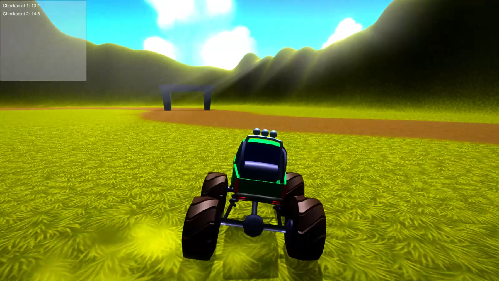

# Extreme Monster Truck Demo
Extreme Monster Truck is a demo game made with [Unity](unity3d.com) that was presented during the "[Introducing C# Developers to Building Games with Unity - For the Hobby Developer](https://channel9.msdn.com/events/dotnetConf/2016/Introducing-C-Developers-to-Building-Games-with-Unity-For-the-Hobby-Developer)" talk at the dotnetConf 2016.

##Credits
Extreme Monster Truck uses free assets provided by the following packs:

* [Hand Painted Forest Environment Free Sample](https://www.assetstore.unity3d.com/en/#!/content/35361)
* [Monster Truck LowPoly](http://www.turbosquid.com/3d-models/3dsmax-monster-truck-uv/440501)
